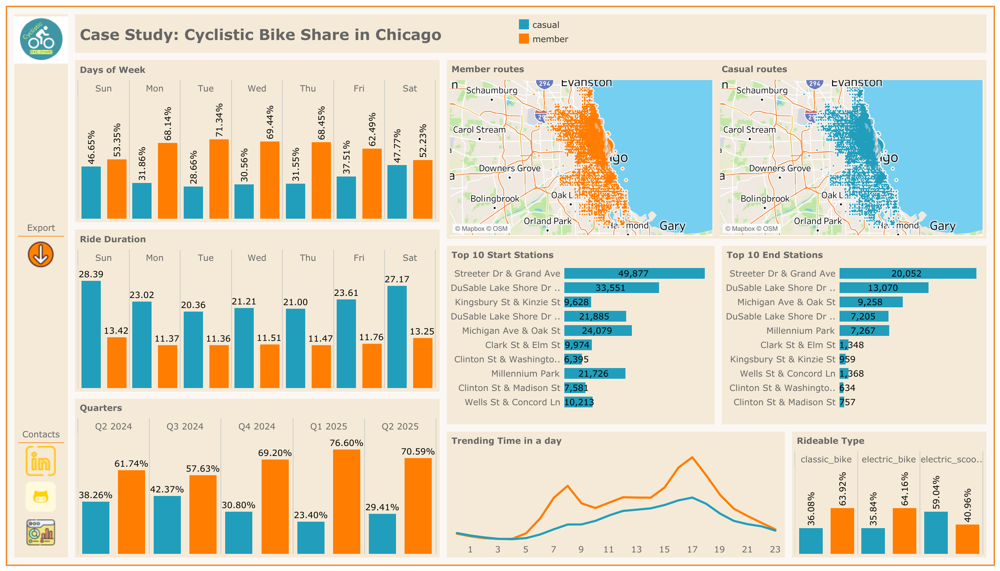

# Cyclistic Bike-Share Case Study

## Overview

This case study is part of the Google Data Analytics Professional Certificate. It focuses on analyzing bike-share data for Cyclistic, a fictional bike-share company in Chicago. The goal is to understand how casual riders and annual members use Cyclistic bikes differently to design marketing strategies aimed at converting casual riders into annual members.

## Business Task

**Primary Question:**  
How do annual members and casual riders use Cyclistic bikes differently?

**Objective:**  
Identify usage patterns between casual riders and annual members to inform marketing strategies that can convert casual riders into annual members, thereby maximizing profitability.

## Data Sources

- **Dataset:** Historical trip data from Cyclistic (publicly available data under license from Motivate International Inc.).
- **Time Frame:** Previous 12 months of trip data (or Divvy 2019 Q1 and Divvy 2020 Q1 datasets if using RStudio).
- **Key Columns:**
  - `ride_length`: Duration of each ride.
  - `day_of_week`: Day the ride started.
  - `member_casual`: User type (member or casual rider).

## Data Preparation and Cleaning

1. **Download and Organize Data:**
   - Downloaded and unzipped the data files.
   - Created folders for `.csv` and `.xls` files to maintain original and processed data.
2. **Data Transformation:**
   - Added `ride_length` column (calculated as `ended_at - started_at`).
   - Added `day_of_week` column (calculated using `WEEKDAY` function).
3. **Data Integrity:**
   - Ensured consistent formatting (e.g., time as `HH:MM:SS`).
   - Checked for missing or erroneous values.

## Analysis

### Key Steps

1. **Descriptive Analysis:**
   - Calculated mean, max, and mode of `ride_length` and `day_of_week`.
2. **Pivot Tables:**
   - Average ride length by user type (`member_casual`).
   - Average ride length by day of the week.
   - Number of rides by user type and day of the week.
3. **Trend Identification:**
   - Compared usage patterns between casual riders and members.
   - Analyzed seasonal variations by merging data into a full-year view.

### Key Findings

- **Usage Duration:** Casual riders tend to take longer rides compared to annual members.
- **Peak Days:** Casual riders use bikes more on weekends, while members show consistent usage throughout the week.
- **Seasonal Trends:** Higher casual rider activity during summer months.

## Visualizations

- **Bar Charts:** Comparing average ride length and number of rides by user type.
- **Line Graphs:** Showing usage trends over days of the week or seasons.
- **Heatmaps:** Highlighting peak usage times for casual riders vs. members.

## Recommendations

1. **Targeted Weekend Promotions:** Offer incentives for casual riders to convert to members on weekends, such as discounted membership sign-ups.
2. **Seasonal Membership Plans:** Introduce flexible summer memberships to attract casual riders during peak usage months.
3. **Digital Campaigns:** Use social media and email marketing to highlight cost savings and convenience of annual memberships, tailored to casual riders' usage patterns.

## Deliverables

1. Business task statement.
2. Data sources and cleaning documentation.
3. Summary of analysis with key findings.
4. Supporting visualizations.
5. Top three recommendations.

## Tools Used

- Spreadsheet software (Excel/Google Sheets) for data cleaning and pivot tables.
- SQL/R (optional) for advanced analysis.
- Visualization tools (Tableau, PowerPoint, or R) for creating polished visuals.

## Conclusion

By analyzing Cyclistic's bike-share data, we identified distinct usage patterns between casual riders and annual members. These insights provide a foundation for targeted marketing strategies to convert casual riders into annual members, driving long-term growth for Cyclistic.

---

_This case study was completed as part of the Google Data Analytics Professional Certificate._
